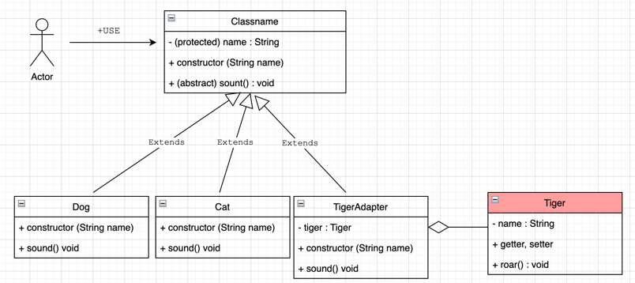
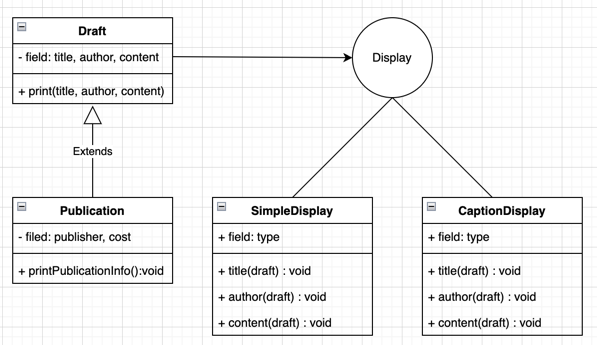
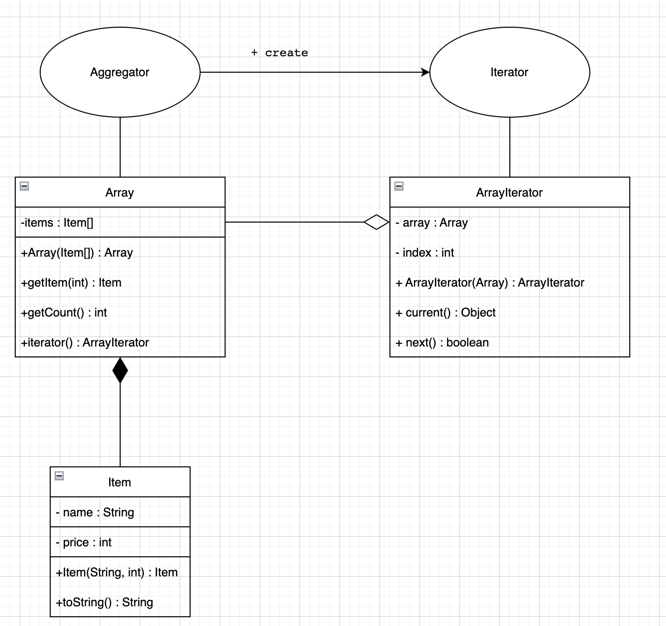
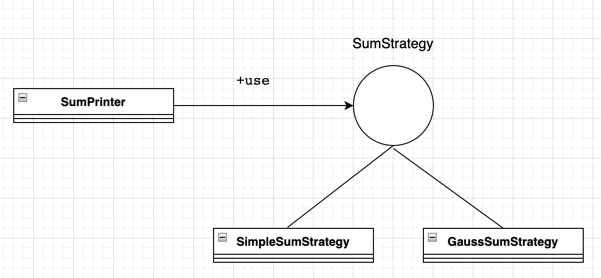
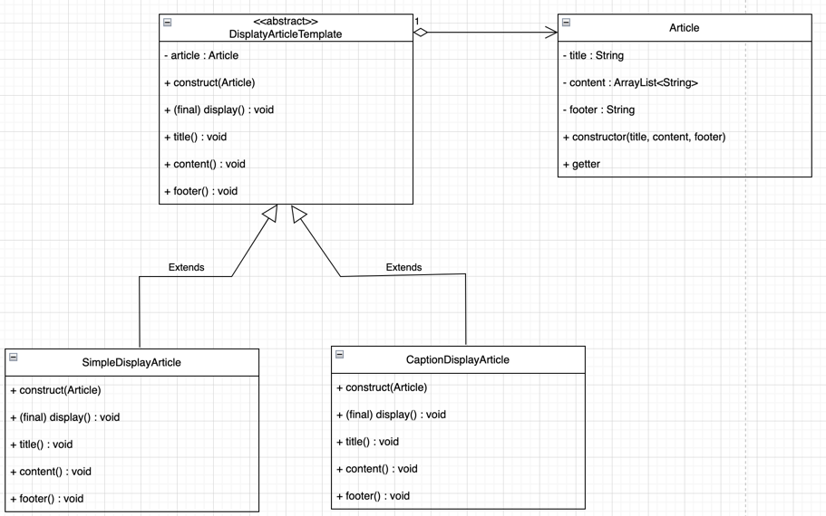

# GOF 패턴 따라해보기 실습 과정
<u>
<a>https://www.youtube.com/watch?v=An7kqZ5D7j8</a>
</u> 
- GIS DEVELOPER님 영상 참조 

개발환경 : Intellij, JDK 11  
<ol>
<h4>목차</h4>
<li>iterator</li>
<li>strategy</li>
<li>Singleton</li>
<li>Bridge</li>
<li>template</li>
<li>Adapter</li>
<li>Flyweight</li>
<li>Composite</li>
<li>Factory Method</li>
<li>Observer</li>
<li>Mediator</li>
<li>Memento</li>
<li>Proxy</li>
<li>Decorator</li>
<li>Chain of Responsibility</li>
<li>Prototype</li>
<li>Facade</li>
<li>Builder</li>
<li>Command</li>
<li>Abstract Factory</li>
<li>State</li>
<li>Interpreter</li>
<li>Visitor</li>
</ol>

### 추상 팩토리(Abstract Factory)

구체적인 클래스를 지정하지 않고 인터페이스를 통해 서로 연관되는 객체들을 그룹으로 표현함

# 생성 패턴
### 빌더(Builder)

복합 객체의 생성과 표현을 분리하여 동일한 생성 절차에서도 다른 표현 결과를 만들어낼 수 있음

### 팩토리 메소드(Factory Method)

객체 생성을 서브클래스로 위임하여 캡슐화함

### 프로토타입(Prototype)

원본 객체를 복사함으로써 객체를 생성함

### 싱글톤(Singleton)

어떤 클래스의 인스턴스는 하나임을 보장하고 어디서든 참조할 수 있도록 함

# 구조 패턴
### 어댑터(Adapter)

클래스의 인터페이스를 다른 인터페이스로 변환하여 다른 클래스가 이용할 수 있도록 함

### 브리지(Bridge)

구현부에서 추상층을 분리하여 각자 독립적으로 확장할 수 있게 함

### 컴포지트(Composite)

객체들의 관계를 트리 구조로 구성하여 복합 객체와 단일 객체를 구분없이 다룸

### 데코레이터(Decorator)

주어진 상황 및 용도에 따라 어떤 객체에 다른 객체를 덧붙이는 방식

### 퍼싸드(Facade)

서브시스템에 있는 인터페이스 집합에 대해 하나의 통합된 인터페이스(Wrapper) 제공

### 플라이웨이트(Flyweight)

크기가 작은 여러 개의 객체를 매번 생성하지 않고 가능한 한 공유할 수 있도록 하여 메모리를 절약함

### 프록시(Proxy)

접근이 어려운 객체로의 접근을 제어하기 위해 객체의 Surrogate나 Placeholder를 제공

# 행위 패턴
### 반복자(iterator)

내부를 노출하지 않고 접근이 잦은 어떤 객체의 원소를 순차적으로 접근할 수 있는 동일한 인터페이스 제공

### 책임 연쇄(Chain of Responsibility)

요청을 받는 객체를 연쇄적으로 묶어 요청을 처리하는 객체를 만날 때까지 객체 Chain을 따라 요청을 전달함

### 커맨드(Command)

요청을 객체의 형태로 캡슐화하여 재사용하거나 취소할 수 있도록 저장함

### 인터프리터(Interpreter)

특정 언어의 문법 표현을 정의함

### 중재자(Mediator)

한 집합에 속해있는 객체들의 상호작용을 캡슐화하여 새로운 객체로 정의

### 메멘토(Memento)

객체가 특정 상태로 다시 되돌아올 수 있도록 내부 상태를 실체화

### 옵서버(Observer)

객체 상태가 변할 때 관련 객체들이 그 변화를 통지받고 자동으로 갱신될 수 있게 함

### 상태(State)

객체의 상태에 따라 동일한 동작을 다르게 처리해야할 때 사용

### 전략(strategy)

동일 계열의 알고리즘군을 정의하고 캡슐화하여 상호교환이 가능하도록 함

### 템플릿 메소드(template Method)

상위클래스는 알고리즘의 골격만을 작성하고 구체적인 처리는 서브클래스로 위임함

### 방문자(Visitor)

객체의 원소에 대해 수행할 연산을 분리하여 별도의 클래스로 구성함

